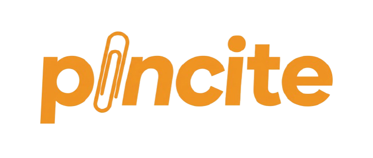
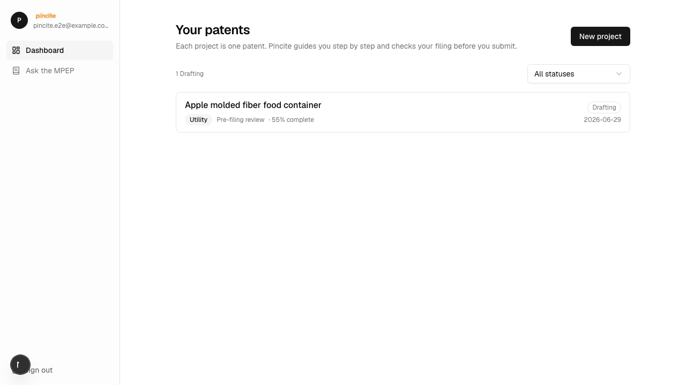
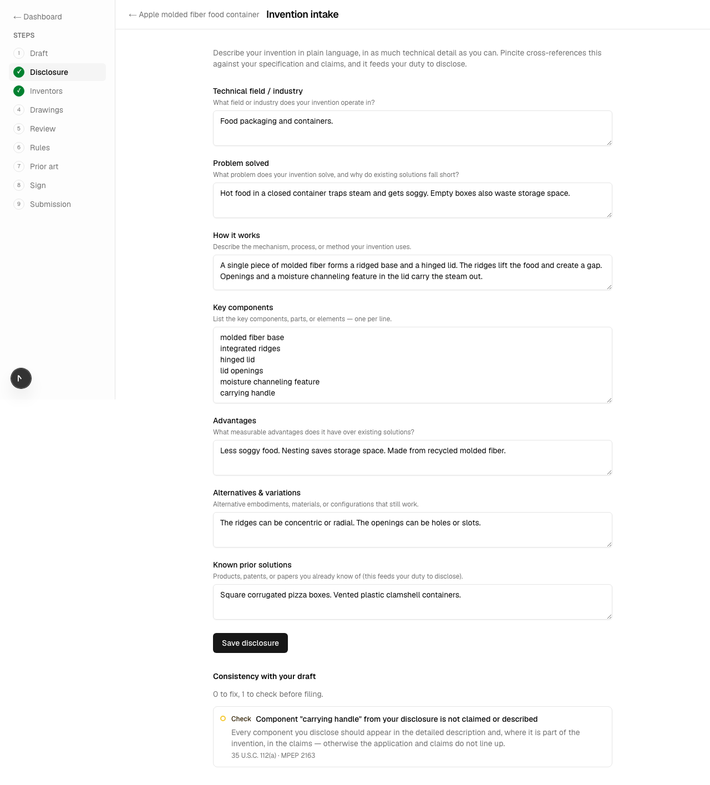
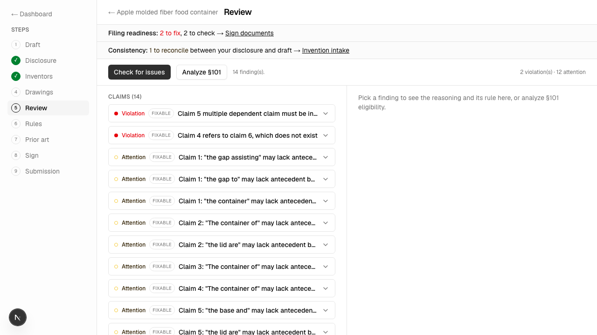
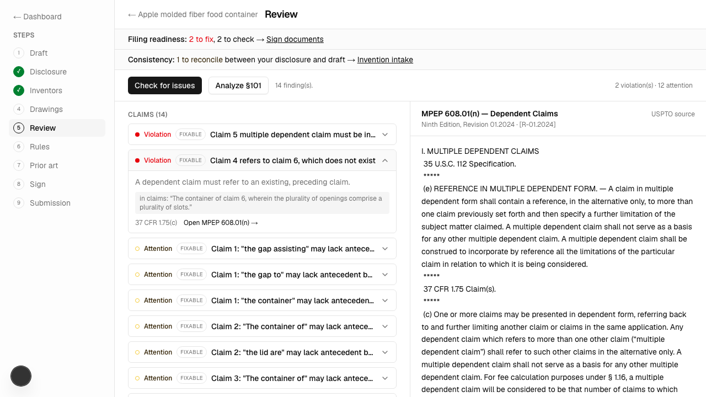
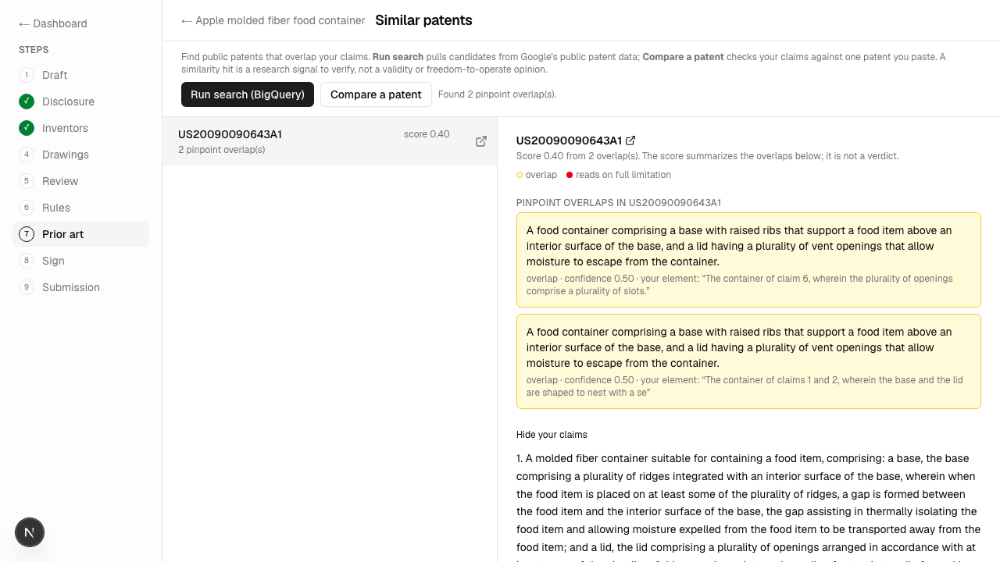
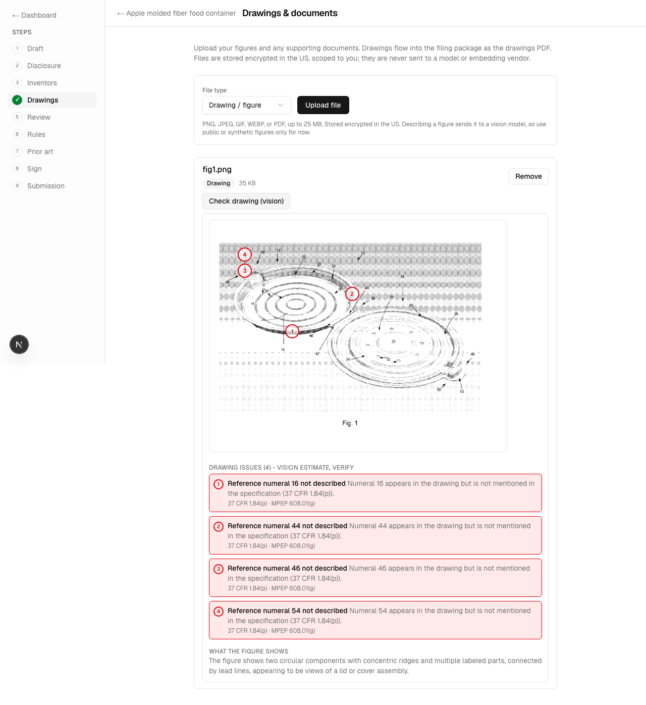
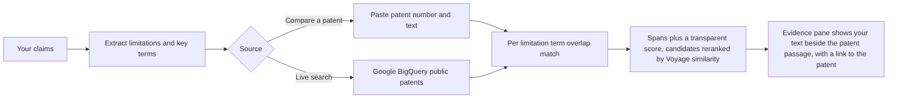
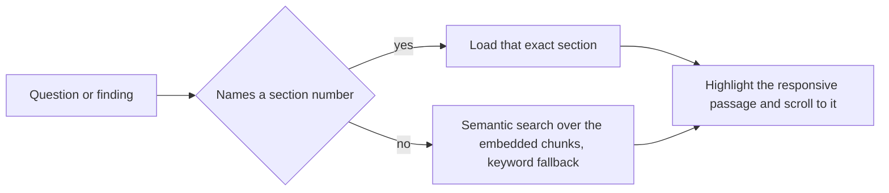
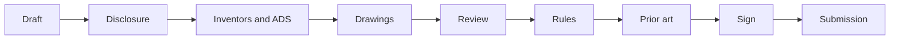

<p align="center"></p>

<p align="center">
  <strong>An active patent review workbench.</strong><br />
  Draft a patent section by section. Pincite flags the rule violations, finds similar public patents,
  and pins every claim it makes to real MPEP text you can open and verify.
</p>

<p align="center">
  
  
  
  
  
  
</p>

---

Pincite helps people draft a US patent. It serves both pro se inventors and patent attorneys. It is not legal advice and not a filing service. It checks what you wrote, shows you the governing rule, and produces a filing ready document set that you hand to the USPTO yourself.

---

## A case study, Apple's circular pizza box

To show the whole thing in action we follow one real already filed invention from intake to review. It is Apple's molded fiber food container, US 2012/0024859 A1 by Francesco Longoni and Mark E. Doutt, the round vented box Apple designed so a pizza does not go soggy. The draft is kept mid review on purpose so the checks have something to catch. All of the text is public.

### The dashboard

Every application shows its status and the single next step that matters, with the deadline critical steps marked in attention. The sidebar is the spine and Dashboard is one click from anywhere.



### Invention intake

You describe the invention in plain language and Pincite cross references it against your specification and claims. Here it catches a carrying handle that was disclosed but never described, so the draft and the disclosure do not drift apart.



### Error handling in action

Run the checks and the findings come back grouped by area as a scannable list. You triage at a glance instead of reading a wall of text. Two real violations sit at the top, a dependent claim that points at a claim that does not exist and a multiple dependent claim written cumulatively rather than in the alternative.



### Click a finding to see why

Click any finding and you land on the reasoning and the governing rule, side by side with your draft. Here the dependent claim that points at a non existent claim 6 opens MPEP 608.01(n) on dependent claims, scrolled to the relevant passage, with the USPTO source linked.



### Finding similar patents

Compare against a patent you paste or pull candidates from Google BigQuery public patents data. Each overlap is pinned to the patent passage and to your own claim element, with a transparent score and a source link. There is no single novelty number, because one number invites over trust.



### Checking the drawings

Upload a figure and Pincite reads it for drawing defects under 37 CFR 1.84 and 1.83. Here, on Apple's own FIG. 1, it catches reference numerals that appear in the drawing but were never introduced in the specification, circling each one in red on the figure and pinning it to the rule. The circle positions are an approximate vision estimate, labeled to verify.



---

## How it works

For a complete walkthrough of every screen, field, and check, see [docs/product-functionality.md](docs/product-functionality.md).

The spine of the app is `validateCitations` in `lib/mpep/citation.ts`. Every MPEP number a check or the model produces gets looked up in the ingested corpus before display. Numbers that resolve are shown and openable. Numbers that do not resolve get dropped. This is the same reason there is no single novelty score for prior art. Pincite leads with the spans instead.

Similar patents



Error checking


MPEP locate



The whole filing flow lives on a left step rail. Each step turns green when it is complete.



The export is a real document set rather than a generic PDF. The specification comes out as a 37 CFR 1.77 DOCX with `[0001]` paragraph numbering and claims and abstract on their own pages, which also avoids the USPTO non DOCX surcharge. The package adds an ADS data card for the Patent Center web form, the inventor declaration, a transmittal, and a fee summary, bundled as a ZIP.

---

## What else is in the box

<table>
  <tr>
    <td width="33%" valign="top">
      <h4>Two roles</h4>
      <p>Pro se inventors sign their own oath. Attorneys get a portfolio across clients and the power of attorney path.</p>
    </td>
    <td width="33%" valign="top">
      <h4>Lifecycle actions</h4>
      <p>What to do now by status, from an office action reply to the issue fee to maintenance fees, each pinned to its rule.</p>
    </td>
    <td width="33%" valign="top">
      <h4>Signed declaration</h4>
      <p>The inventor declaration is recorded and checked for defects, like a name that does not match the application data sheet.</p>
    </td>
  </tr>
  <tr>
    <td width="33%" valign="top">
      <h4>USPTO export</h4>
      <p>A 37 CFR 1.77 specification DOCX plus an ADS data card, a declaration, a transmittal, and a fee summary in one ZIP.</p>
    </td>
    <td width="33%" valign="top">
      <h4>Versioning and audit</h4>
      <p>Every save is an append only snapshot and every meaningful action is written to an audit log.</p>
    </td>
    <td width="33%" valign="top">
      <h4>Confidentiality and cost</h4>
      <p>US region storage with row level security per user, per user rate limits and budget caps on every paid call, and synthetic text only until xAI zero data retention is on (Voyage already opted out).</p>
    </td>
  </tr>
</table>

---

## Tech stack

| Layer | Tools |
| --- | --- |
| Framework | Next.js 15 App Router with React Server Components, Server Actions, and Route Handlers |
| Language | TypeScript 5 |
| UI | React 19, Tailwind CSS v4, shadcn/ui on Radix primitives, lucide-react icons, Turbopack in dev |
| Design system | A three signal color system where red is a violation, yellow is attention, and green is a pass, each with a shape and a label for accessibility |
| Database | Supabase Postgres with pgvector for embeddings and a tsvector full text index for MPEP search |
| Data access | PostgREST through `@supabase/supabase-js` with cookie based SSR sessions through `@supabase/ssr` |
| Migrations | Raw SQL applied with node-postgres (`pg`) via `scripts/db-apply.mjs` |
| Security | Row level security on every table, per user rate limits and account wide budget caps on paid calls, append only versioning, and an audit log |
| Auth | Supabase Auth with email and password plus Google OAuth, and a development only login used by the tests |
| Storage | A private US region Supabase Storage bucket for drawings, written through an ownership checked service role client |
| Generation model | xAI Grok `grok-4.3` for the §101 walkthrough |
| Embeddings | Voyage `voyage-law-2`, a legal tuned 1024 dimension model, over the MPEP corpus |
| Prior art | Google BigQuery `patents-public-data` through a service account, with PatentsView as a key free fallback |
| Export | `docx` for the specification and `jszip` for the filing package |
| Testing | Playwright end to end gate and `@axe-core/playwright` for accessibility |
| Tooling | pnpm and ESLint |

---

## Data model

```
projects             id, user_id, name, patent_type, declared_status, applicant fields, entity_status, client_name, matter_no
project_sections     project_id, section_key, content, word_count        (history in project_versions, append only)
project_disclosure   project_id, problem_solved, how_it_works, components, advantages, alternatives, known_prior_art
project_inventors    project_id, legal_name, residence, mailing_address, citizenship
project_declarations project_id, inventor_id, legal_name, statements, signed_at        (append only)
project_attachments  project_id, kind, storage_path, filename, mime       (bytes live in the private Storage bucket)
findings             project_id, section_key, span_start, span_end, severity, kind, mpep_section, cfr_ref
mpep_sections        the ingested MPEP, with a tsvector full text index
mpep_chunks          chunked MPEP text embedded into a pgvector column
prior_art_matches    scored candidate patents, with the pinpoint overlaps in match_spans
audit_log            append only record of every meaningful action
```

Row level security scopes every table to its owner. Saves never overwrite history.

---

## Running it locally

```bash
pnpm install

# Create .env.local (never committed). It needs at least these names.
#   NEXT_PUBLIC_SUPABASE_URL
#   NEXT_PUBLIC_SUPABASE_ANON_KEY
#   SUPABASE_SERVICE_ROLE_KEY
#   SUPABASE_DB_URL                  direct Postgres URL for migrations
#   XAI_API_KEY                      Grok generation
#   GEMINI_API_KEY                   fallback generation
#   VOYAGE_API_KEY                   MPEP embeddings
#   GOOGLE_APPLICATION_CREDENTIALS   local path to a BigQuery service account JSON (outside the repo)
#   GOOGLE_APPLICATION_CREDENTIALS_JSON  or the full service account JSON inline (production / Vercel)
#   DEV_LOGIN_SECRET                 development only test login

# Apply the schema, then reload the PostgREST cache.
node --env-file=.env.local scripts/db-apply.mjs supabase/migrations/0001_phase0_init.sql
#   repeat through the latest migration, then run  notify pgrst, 'reload schema'

# Set up the private Storage bucket for drawings.
node --env-file=.env.local scripts/setup-storage.mjs

# Ingest the MPEP text, then embed it (the embed pass is resumable).
node --env-file=.env.local scripts/ingest-mpep.mjs
node --env-file=.env.local scripts/embed-mpep.mjs

pnpm dev    # http://localhost:3100
```

Other commands are `pnpm build`, `pnpm lint`, `pnpm exec playwright test` for the full gate, and `pnpm exec playwright test e2e/<feature>.spec.ts` for one. Port 3100 is intentional because 3000 is reserved for another local app.

---

## Project structure

```
app/                     Next routes (dashboard, /projects/[id]/* step pages, /api)
lib/
  mpep/                  locate, load, citation validation, highlight (the evidence pane)
  patents/               extract limitations, BigQuery search, pinpoint match and score
  validators/            tier1 to tier3 plus filing and crossref checks that produce findings
  filing/                inventors, applicant and ADS, attachments, declarations
  disclosure/            the plain language invention intake
  lifecycle/             what to do now by application status
  export/                report (TXT), docx (specification), filing package (zip)
  stage/  rules/         stage detection and rule surfacing
  projects/              projects, sections, append only versions
  supabase/              server, client, middleware, and admin clients
supabase/migrations/     0001 onward, each with row level security
e2e/                     Playwright specs (one per feature) plus the case study generator
scripts/                 db-apply, ingest-mpep, embed-mpep, verify-rls, setup-storage
docs/                    product functionality, architecture, style guide, business context, api reference
```

---

## Disclaimer

Pincite is not legal advice and not a filing service. A human stays in the loop. A similarity hit is a candidate to verify, not a conclusion about validity or patentability. Use synthetic or non confidential text for now, because real unfiled invention text should only go to zero data retention vendors. Voyage retention is opted out, and xAI zero data retention is the last piece to enable, so it stays the blocker until then. The full gate is 21 specs green with the accessibility scan clean on every screen. Semantic MPEP locate and Voyage semantic candidate ranking for prior art are now wired. Drawings get a vision check too. A model reads a figure and Pincite flags drawing issues under 37 CFR 1.84 and 1.83, a reference numeral on the drawing that is not in the specification, a missing figure label, and a disclosed component that is not shown, marking each located issue with a numbered red circle on the figure pinned to the rule, restricted to public or synthetic figures until vendor zero data retention is on.
