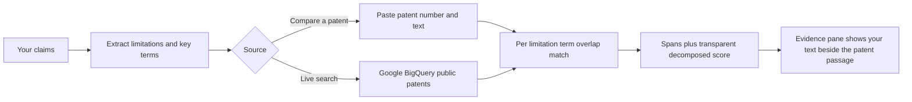
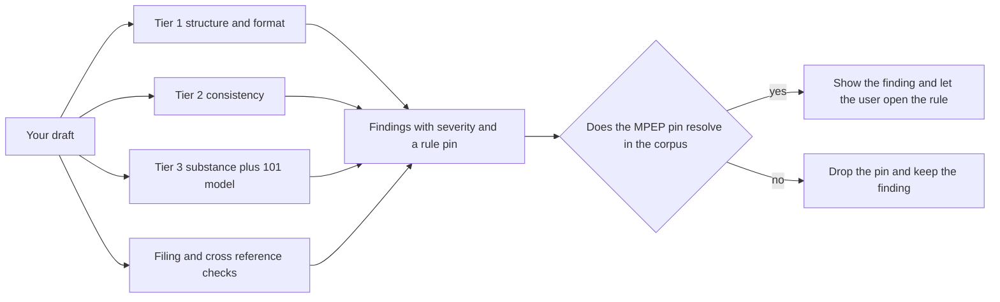
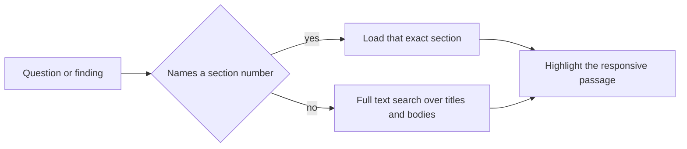
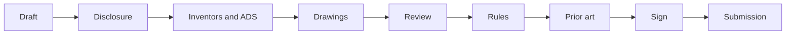

# Pincite

Draft a US patent section by section. Pincite flags the rule violations, finds similar public patents, and pins every claim it makes to real MPEP and CFR text. Nothing reaches the screen without a citation you can open and verify.

    

Pincite is a research and review aid for people drafting a US patent. It serves both pro se inventors and patent attorneys. It is not legal advice and not a filing service. It checks what you wrote, shows you the governing rule, and produces a filing ready document set that you hand to the USPTO yourself.

The screenshots below use a public example, Apple's circular pizza box (design patent USD670491). All sample text is synthetic.


---

## What it does

### Finding similar patents

Pincite breaks each claim into its limitations and key terms. It compares them against a patent you paste or against candidates pulled from Google BigQuery public patents data. For each limitation it finds the overlapping passage and shows a transparent decomposed score with the exact spans. It never reduces this to a single black box novelty number. The matching is deterministic lexical overlap today. Voyage semantic ranking is a planned layer (see below).


### Catching errors

Errors are deterministic rule checks over your draft. They run in tiers for structure and format, for consistency, and for substance, plus a model assisted §101 walkthrough. Each finding carries a severity, an actionable or informational flag, and a citation to the governing rule. A finding only shows its MPEP pin when that section actually resolves in the ingested corpus, so it can never invent a rule.


### Finding the relevant MPEP text

When your question names a section number Pincite loads that exact section from the ingested MPEP corpus. Otherwise it runs a Postgres full text search over section titles and bodies and returns the best matches. It then highlights the most responsive passage in a side by side evidence pane.


---

## How each pipeline works

Similar patents



Error checking



MPEP locate



---

## The discipline behind it

The spine of the app is `validateCitations` in `lib/mpep/citation.ts`. Every MPEP number a check or the model produces gets looked up in the ingested corpus before display. Numbers that resolve are shown and openable. Numbers that do not resolve get dropped. This keeps findings honest. It is also why there is no single novelty score for prior art. A single number invites over trust, so Pincite leads with the spans instead.

---

## Two roles, one engine

You pick a role once after consent. The drafting, checking, and export engine is the same for both. What changes is the framing.

A pro se inventor gets a guided plain English flow and personally signs the inventor declaration (PTO/AIA/01). A patent attorney gets a denser portfolio grouped by client and matter, files a power of attorney (PTO/AIA/82), and signs the prosecution papers while inventors sign their own oath. Who may sign and assignment checks fire when the applicant is a company.


---

## The full filing workflow

A left step rail walks the whole process. Each step turns green when it is complete, and Dashboard is one click away from any step. The draft autosaves.



- **Draft** is the specification in 37 CFR 1.77 order. It is plain text so character offsets stay stable for highlights.
- **Disclosure** is the plain language invention intake. Pincite cross references it against your draft.
- **Inventors and ADS** captures inventor and applicant data (PTO/AIA/14), entity status, and citizenship.
- **Drawings** uploads images and PDFs to a private US region bucket.
- **Review, Rules, Prior art** show findings grouped by area, the applicable rules, and similar patents.
- **Sign** records the inventor declaration and runs the filing readiness checks.
- **Submission** produces the export.

The export is a real document set rather than a generic PDF. The specification comes out as a 37 CFR 1.77 DOCX with `[0001]` paragraph numbering and claims and abstract on their own pages, which also avoids the USPTO non DOCX surcharge. The package adds an ADS data card for the Patent Center web form, the inventor declaration, a transmittal, and a fee summary, bundled as a ZIP.

---

## Tech stack

| Layer | What we use |
| --- | --- |
| Framework | Next.js 15 App Router with React Server Components, Server Actions, and Route Handlers |
| Language | TypeScript 5 |
| UI | React 19, Tailwind CSS v4, shadcn/ui (new-york) on Radix primitives, Turbopack in dev |
| Design system | A strict three signal color system where red means violation, yellow means attention, and green means pass, with a shape and label on every signal for accessibility |
| Database | Supabase Postgres with pgvector for embeddings and a tsvector full text index for MPEP search |
| Data access | PostgREST through `@supabase/supabase-js` and cookie based SSR sessions through `@supabase/ssr` |
| Migrations | Raw SQL applied with node-postgres (`pg`) via `scripts/db-apply.mjs` |
| Security | Row level security on every table, append only versioning, and an audit log |
| Auth | Supabase Auth with Google OAuth, plus a development only login used by the test suite |
| Storage | A private US region Supabase Storage bucket for drawings, written through an ownership checked service role client |
| Generation model | xAI Grok `grok-4.3` for the §101 walkthrough, with a Gemini fallback |
| Embeddings | Voyage `voyage-law-2`, a legal tuned 1024 dimension model, over the MPEP corpus |
| Prior art | Google BigQuery `patents-public-data` through a server side service account, with PatentsView documented as a key free fallback |
| Export | `docx` for the specification and `jszip` for the filing package |
| Testing | Playwright end to end gate and `@axe-core/playwright` for accessibility |
| Tooling | pnpm and ESLint |

---

## How the code is laid out

```
app/                     Next routes (dashboard, /projects/[id]/* step pages, /api)
lib/
  mpep/                  locate, load, citation validation, highlight (the evidence pane)
  patents/               extract limitations, BigQuery search, pinpoint match and score
  validators/            tier1 to tier3 plus filing and crossref checks that produce findings
  filing/                inventors, applicant and ADS, attachments, declarations
  disclosure/            the plain language invention intake
  lifecycle/             what to do now by application status
  export/                report (TXT), docx (specification), filing package (zip)
  stage/  rules/         stage detection and rule surfacing
  projects/              projects, sections, append only versions
  supabase/              server, client, middleware, and admin clients
supabase/migrations/     0001 through 0009, each with row level security
e2e/                     Playwright specs (one per feature) plus helpers
scripts/                 db-apply, ingest-mpep, embed-mpep, verify-rls, setup-storage
docs/                    architecture, style guide, business context, api reference
```

---

## Getting started

```bash
pnpm install

# Create .env.local (never committed). It needs at least these names.
#   NEXT_PUBLIC_SUPABASE_URL
#   NEXT_PUBLIC_SUPABASE_ANON_KEY
#   SUPABASE_SERVICE_ROLE_KEY
#   SUPABASE_DB_URL                  direct Postgres URL for migrations
#   XAI_API_KEY                      Grok generation
#   GEMINI_API_KEY                   fallback generation
#   VOYAGE_API_KEY                   MPEP embeddings
#   GOOGLE_APPLICATION_CREDENTIALS   path to a BigQuery service account JSON outside the repo
#   DEV_LOGIN_SECRET                 development only test login

# Apply the schema, then reload the PostgREST cache.
node --env-file=.env.local scripts/db-apply.mjs supabase/migrations/0001_phase0_init.sql
#   repeat through 0009, then run  notify pgrst, 'reload schema'

# Set up the private Storage bucket for drawings.
node --env-file=.env.local scripts/setup-storage.mjs

# Ingest the MPEP text, then embed it (the embed pass is resumable).
node --env-file=.env.local scripts/ingest-mpep.mjs
node --env-file=.env.local scripts/embed-mpep.mjs

pnpm dev    # http://localhost:3100
```

Other commands are `pnpm build`, `pnpm lint`, `pnpm exec playwright test` for the full gate, and `pnpm exec playwright test e2e/<feature>.spec.ts` for one. Port 3100 is intentional because 3000 is reserved for another local app.

---

## Verification

Every feature ships behind a Playwright gate. It passes only with zero console errors, zero page exceptions, no failed requests on its path, and a screenshot that matches the spec including the color discipline. Results live in [VERIFICATION-LOG.md](screenshots/VERIFICATION-LOG.md). Current state is 21 specs green with the accessibility scan clean on every screen.

---

## Enabling Voyage semantic ranking

The embeddings client already exists in `lib/embeddings/voyage.ts` and the MPEP is already embedded into `mpep_chunks` with pgvector, so the pieces are in place. Two places can use it.

For prior art, embed each claim limitation and each candidate passage with `embedOne`, score them by cosine similarity, and blend that with the existing lexical score in `lib/patents/match.ts`. For MPEP locate, embed the query and run a pgvector nearest neighbor search over `mpep_chunks`, then fall back to the current full text search. Both need a Voyage API key with a billing method, since the free tier throttles at a few requests per minute.

---

## Status and disclaimers

- Pincite is not legal advice and not a filing service. A human stays in the loop. A similarity hit is a candidate to verify, not a conclusion about validity or patentability.
- Use synthetic or non confidential text for now. Real unfiled invention text should only go to zero data retention vendors, and xAI currently reports that retention is on for the team, so keep the data synthetic until that is fixed.
- Not built yet are the wired semantic MPEP locate inside Ask, Voyage semantic ranking for prior art, and any analysis of the drawings themselves.
