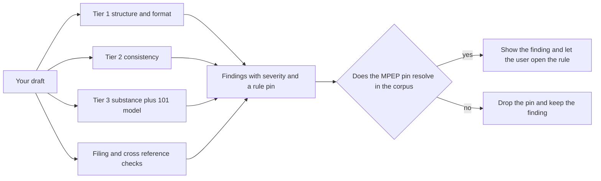
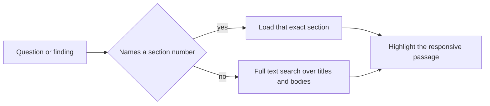
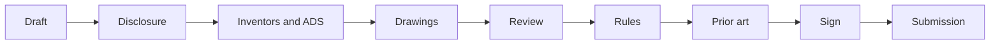

<h1 align="center">Pincite</h1>

<p align="center">
  <strong>An active patent review workbench.</strong><br />
  Draft a patent section by section. Pincite flags the rule violations, finds similar public patents,
  and pins every claim it makes to real MPEP text you can open and verify.
</p>

<p align="center">
  
  
  
  
  
  
</p>

---

Pincite helps people draft a US patent. It serves both pro se inventors and patent attorneys. It is not legal advice and not a filing service. It checks what you wrote, shows you the governing rule, and produces a filing ready document set that you hand to the USPTO yourself.

The screenshots use a real already filed example, Apple's molded fiber food container (US 2012/0024859 A1 by Francesco Longoni and Mark E. Doutt, assigned to Apple Inc.). The draft is shown mid review so the checks have something to catch.


---

## What it does

### Catching errors

Pincite runs deterministic rule checks over your draft. They cover formatting and structure, then consistency, then substance, plus a model assisted §101 walkthrough. Each finding has a severity and a citation to the rule, and the list is grouped by where the problem sits. A finding only shows its MPEP pin when that section resolves in the ingested corpus, so it can never invent a rule.


### Finding similar patents

Pincite breaks each claim into its limitations and key terms. It compares them against a patent you paste or against candidates pulled from Google BigQuery public patents data. For each limitation it finds the overlapping passage and shows a transparent score with the exact spans. It never reduces this to a single novelty number.


### Referencing the MPEP automatically

When a finding cites a rule you open it in place and the section text loads beside your draft. When you ask by section number Pincite loads that exact section, and otherwise it runs a full text search over the corpus and highlights the responsive passage.


### And the rest

<table>
  <tr>
    <td width="33%" valign="top">
      <h4>Invention intake</h4>
      <p>A plain language disclosure (problem, mechanism, components) that Pincite cross references against your draft to catch what does not line up.</p>
    </td>
    <td width="33%" valign="top">
      <h4>Two roles</h4>
      <p>Pro se inventors sign their own oath. Attorneys get a portfolio across clients and the power of attorney path.</p>
    </td>
    <td width="33%" valign="top">
      <h4>Lifecycle actions</h4>
      <p>What to do now by status, from an office action reply to the issue fee to maintenance fees, each pinned to its rule.</p>
    </td>
  </tr>
  <tr>
    <td width="33%" valign="top">
      <h4>USPTO export</h4>
      <p>A 37 CFR 1.77 specification DOCX plus an ADS data card, a declaration, a transmittal, and a fee summary in one ZIP.</p>
    </td>
    <td width="33%" valign="top">
      <h4>Versioning and audit</h4>
      <p>Every save is an append only snapshot and every meaningful action is written to an audit log.</p>
    </td>
    <td width="33%" valign="top">
      <h4>Confidentiality</h4>
      <p>US region storage with row level security per user, and synthetic text only until vendor zero data retention is confirmed.</p>
    </td>
  </tr>
</table>

---

## How it works

The spine of the app is `validateCitations` in `lib/mpep/citation.ts`. Every MPEP number a check or the model produces gets looked up in the ingested corpus before display. Numbers that resolve are shown and openable. Numbers that do not resolve get dropped. This is also why there is no single novelty score for prior art. A single number invites over trust, so Pincite leads with the spans instead.

Similar patents


Error checking



MPEP locate



---

## The filing workflow

A left step rail walks the whole process. Each step turns green when it is complete, and Dashboard is one click away from any step. The draft autosaves.



The export is a real document set rather than a generic PDF. The specification comes out as a 37 CFR 1.77 DOCX with `[0001]` paragraph numbering and claims and abstract on their own pages, which also avoids the USPTO non DOCX surcharge. The package adds an ADS data card for the Patent Center web form, the inventor declaration, a transmittal, and a fee summary, bundled as a ZIP.


---

## Tech stack

| Layer | Tools |
| --- | --- |
| Framework | Next.js 15 App Router with React Server Components, Server Actions, and Route Handlers |
| Language | TypeScript 5 |
| UI | React 19, Tailwind CSS v4, shadcn/ui on Radix primitives, Turbopack in dev |
| Design system | A three signal color system where red is a violation, yellow is attention, and green is a pass, each with a shape and a label for accessibility |
| Database | Supabase Postgres with pgvector for embeddings and a tsvector full text index for MPEP search |
| Data access | PostgREST through `@supabase/supabase-js` with cookie based SSR sessions through `@supabase/ssr` |
| Migrations | Raw SQL applied with node-postgres (`pg`) via `scripts/db-apply.mjs` |
| Security | Row level security on every table, append only versioning, and an audit log |
| Auth | Supabase Auth with Google OAuth, plus a development only login used by the tests |
| Storage | A private US region Supabase Storage bucket for drawings, written through an ownership checked service role client |
| Generation model | xAI Grok `grok-4.3` for the §101 walkthrough with a Gemini fallback |
| Embeddings | Voyage `voyage-law-2`, a legal tuned 1024 dimension model, over the MPEP corpus |
| Prior art | Google BigQuery `patents-public-data` through a service account, with PatentsView as a key free fallback |
| Export | `docx` for the specification and `jszip` for the filing package |
| Testing | Playwright end to end gate and `@axe-core/playwright` for accessibility |
| Tooling | pnpm and ESLint |

---

## Data model

```
projects             id, user_id, name, patent_type, declared_status, applicant fields, entity_status, client_name, matter_no
project_sections     project_id, section_key, content, word_count        (history in project_versions, append only)
project_disclosure   project_id, problem_solved, how_it_works, components, advantages, alternatives, known_prior_art
project_inventors    project_id, legal_name, residence, mailing_address, citizenship
project_declarations project_id, inventor_id, legal_name, statements, signed_at        (append only)
project_attachments  project_id, kind, storage_path, filename, mime       (bytes live in the private Storage bucket)
findings             project_id, section_key, span_start, span_end, severity, kind, mpep_section, cfr_ref
mpep_sections        the ingested MPEP, with a tsvector full text index
mpep_chunks          chunked MPEP text embedded into a pgvector column
prior_art_matches    scored candidate patents, with the pinpoint overlaps in match_spans
audit_log            append only record of every meaningful action
```

Row level security scopes every table to its owner. Saves never overwrite history.

---

## Running it locally

```bash
pnpm install

# Create .env.local (never committed). It needs at least these names.
#   NEXT_PUBLIC_SUPABASE_URL
#   NEXT_PUBLIC_SUPABASE_ANON_KEY
#   SUPABASE_SERVICE_ROLE_KEY
#   SUPABASE_DB_URL                  direct Postgres URL for migrations
#   XAI_API_KEY                      Grok generation
#   GEMINI_API_KEY                   fallback generation
#   VOYAGE_API_KEY                   MPEP embeddings
#   GOOGLE_APPLICATION_CREDENTIALS   path to a BigQuery service account JSON outside the repo
#   DEV_LOGIN_SECRET                 development only test login

# Apply the schema, then reload the PostgREST cache.
node --env-file=.env.local scripts/db-apply.mjs supabase/migrations/0001_phase0_init.sql
#   repeat through 0009, then run  notify pgrst, 'reload schema'

# Set up the private Storage bucket for drawings.
node --env-file=.env.local scripts/setup-storage.mjs

# Ingest the MPEP text, then embed it (the embed pass is resumable).
node --env-file=.env.local scripts/ingest-mpep.mjs
node --env-file=.env.local scripts/embed-mpep.mjs

pnpm dev    # http://localhost:3100
```

Other commands are `pnpm build`, `pnpm lint`, `pnpm exec playwright test` for the full gate, and `pnpm exec playwright test e2e/<feature>.spec.ts` for one. Port 3100 is intentional because 3000 is reserved for another local app.

---

## Project structure

```
app/                     Next routes (dashboard, /projects/[id]/* step pages, /api)
lib/
  mpep/                  locate, load, citation validation, highlight (the evidence pane)
  patents/               extract limitations, BigQuery search, pinpoint match and score
  validators/            tier1 to tier3 plus filing and crossref checks that produce findings
  filing/                inventors, applicant and ADS, attachments, declarations
  disclosure/            the plain language invention intake
  lifecycle/             what to do now by application status
  export/                report (TXT), docx (specification), filing package (zip)
  stage/  rules/         stage detection and rule surfacing
  projects/              projects, sections, append only versions
  supabase/              server, client, middleware, and admin clients
supabase/migrations/     0001 through 0009, each with row level security
e2e/                     Playwright specs (one per feature) plus the case study generator
scripts/                 db-apply, ingest-mpep, embed-mpep, verify-rls, setup-storage
docs/                    architecture, style guide, business context, api reference
```

---

## Honest numbers

Pincite is not legal advice and not a filing service. A human stays in the loop. A similarity hit is a candidate to verify, not a conclusion about validity or patentability. Use synthetic or non confidential text for now, because real unfiled invention text should only go to zero data retention vendors and xAI currently reports that retention is on for the team. The full gate is 21 specs green with the accessibility scan clean on every screen. Not built yet are the semantic MPEP locate wired into Ask, Voyage semantic ranking for prior art, and any analysis of the drawings themselves.
