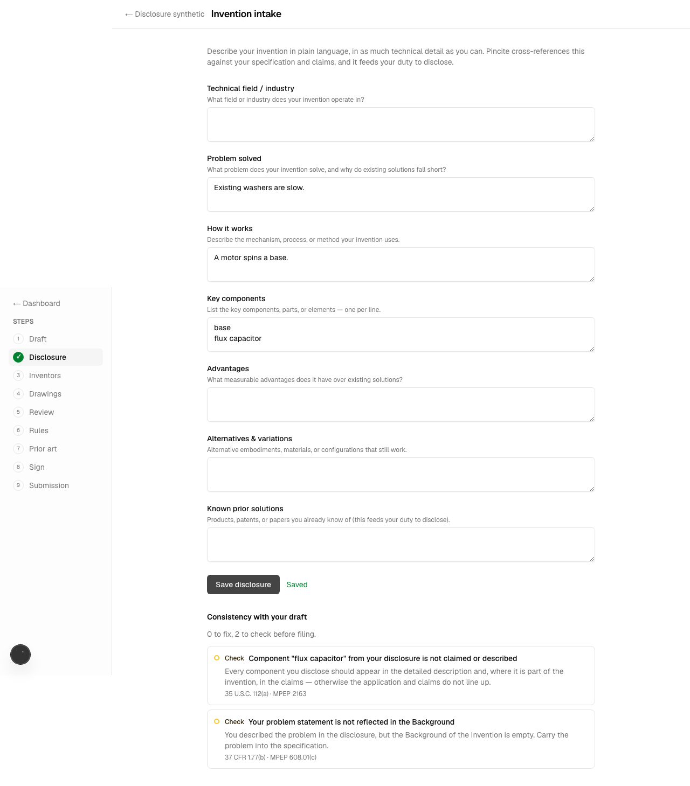
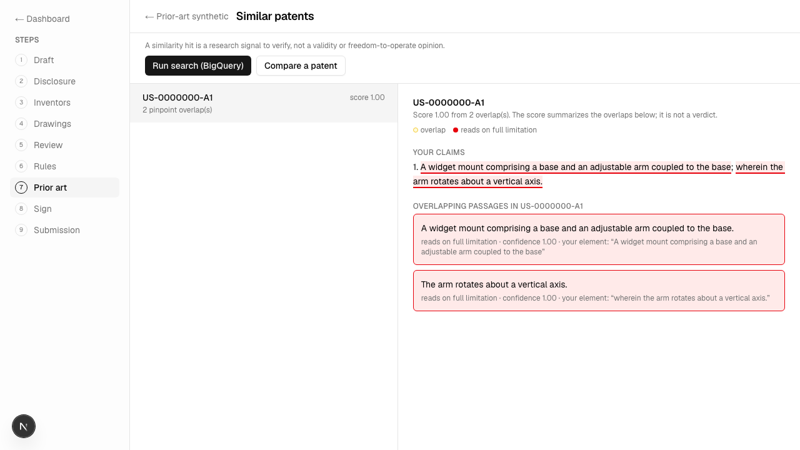
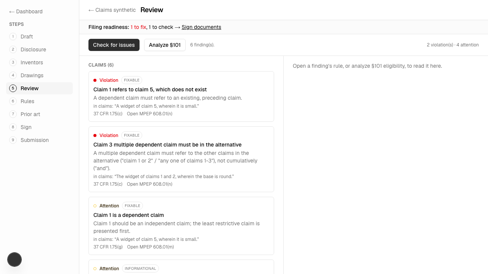
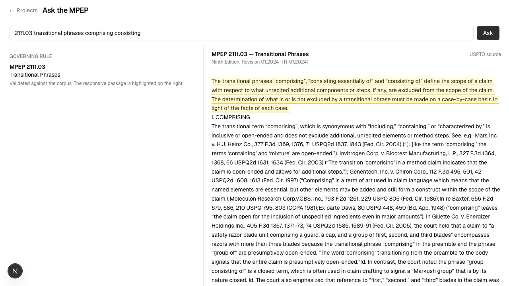
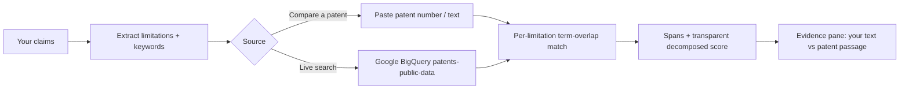
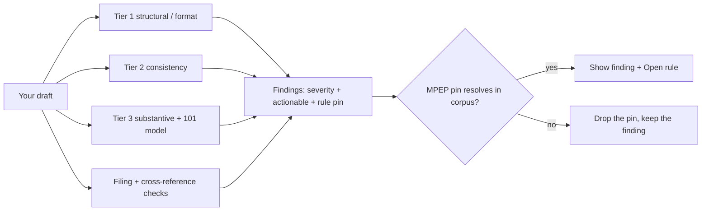
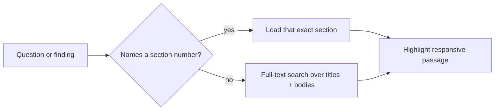
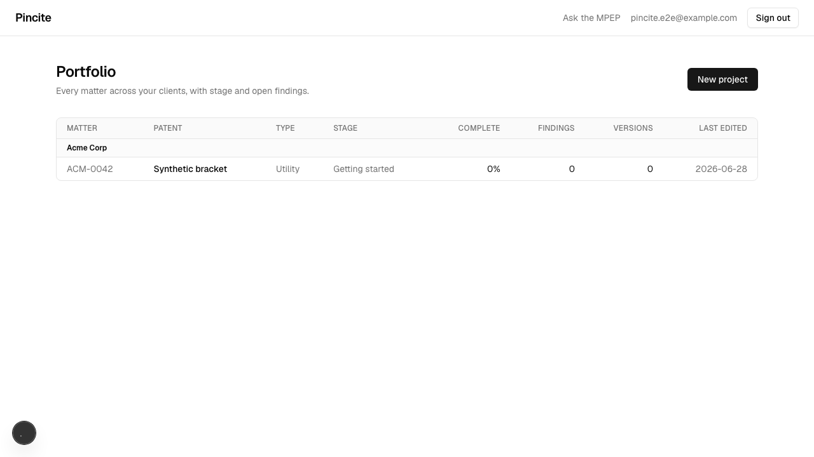
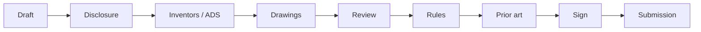

# Pincite

**An active patent review workbench. Draft a patent section by section, and Pincite flags the rule violations, finds similar public patents, and pins every claim it makes to real MPEP/CFR text — so nothing reaches the screen without a citation you can verify.**

    

Pincite is a research and review aid for people drafting a US patent — both pro se inventors and patent attorneys/agents. It is **not legal advice and not a filing service.** It checks what you wrote, shows you the governing rule, and produces a filing-ready document set you hand to the USPTO yourself.



---

## The three things it does, in plain terms

### 1. Finding similar patents
Pincite breaks your claim into its individual **limitations** and significant terms, then either compares them against a patent you paste in or pulls candidate patents from **Google BigQuery's `patents-public-data`** dataset by claim keyword; for each limitation it finds the patent passage with the strongest term overlap and reports a **transparent, decomposed overlap score with the exact overlapping spans** — never a single black-box "novelty" verdict. The matching is deterministic lexical overlap today; Voyage semantic ranking is wired but intentionally left off.



### 2. Error handling (catching rule violations)
Errors are **deterministic rule checks** over your draft, run in tiers — structural/format (title length, abstract word limit, claim numbering, single-sentence, transitional phrases, dependent + multiple-dependent rules), consistency (means-plus-function, antecedent basis, disclosure cross-reference), plus a model-assisted §101 walkthrough — each producing a **finding** with a severity (violation / attention), an actionable-vs-informational flag, and a citation to the governing rule. A finding only shows its MPEP pin if that section actually resolves in the ingested corpus, so it can never invent a rule.



### 3. Finding the relevant MPEP text
If your question names a section number, Pincite loads **that exact section** from the ingested MPEP corpus; otherwise it runs a **Postgres full-text search** over section titles and bodies and returns the best matches, then highlights the most responsive passage in a side-by-side evidence pane. (Semantic / pgvector search over the embedded chunks is ingested and ready, but not yet wired into the locate step.)



---

## How each pipeline works

**Similar patents**



**Error checking**



**MPEP locate**



---

## The discipline: no claim without a citation

The spine of the app is `validateCitations` (`lib/mpep/citation.ts`): every MPEP section number a check or the model produces is looked up in the ingested corpus before display. Cites that resolve are shown and openable; cites that don't are dropped. CFR/USC references are shown as plain statutory references. This is what keeps findings honest — and why there is deliberately **no single "novelty score"** for prior art (it would invite over-trust; we lead with the spans instead).

---

## Two roles, one engine

You pick a role once, after consent. The drafting, checking, and export engine is identical; what differs:

- **Pro se inventor** — guided, plain-English flow; you personally sign the inventor's declaration (PTO/AIA/01); dashboard shows simple project cards.
- **Patent attorney / agent** — a denser **portfolio** grouped by client and matter; you file a power of attorney (PTO/AIA/82) and sign prosecution papers while inventors sign their own oath; who-may-sign and assignment checks fire when the applicant is a company.



---

## The full filing workflow

A left step rail walks the whole process; each step ticks green as it's complete, and **Dashboard** is one click from anywhere (the draft autosaves):



- **Draft** — the specification, section by section (37 CFR 1.77 order), plain-text so character offsets stay stable for highlights.
- **Disclosure** — plain-language invention intake (problem, mechanism, components, advantages, alternatives, known prior art), cross-referenced against the draft.
- **Inventors / ADS** — inventor + applicant data (PTO/AIA/14), entity status, citizenship.
- **Drawings** — secure uploads to a private US-region bucket.
- **Review / Rules / Prior art** — findings grouped by area, applicable rules, similar patents.
- **Sign** — recorded inventor declaration + filing-readiness checks.
- **Submission** — a USPTO-aligned export (see below).

The export is a real document set, not a generic PDF: the specification as a **37 CFR 1.77 DOCX** (`[0001]` paragraph numbering, claims/abstract on their own pages — DOCX avoids the USPTO surcharge), an ADS data card for Patent Center's web form, the inventor's declaration, a transmittal, and a fee summary, bundled as a ZIP.

---

## Tech stack

| Area | Choice |
|---|---|
| Framework | Next.js 15 (App Router), React 19, TypeScript |
| UI | Tailwind v4, shadcn/ui (new-york); strict 3-color signal system (red = violation, yellow = attention, green = pass) |
| Data / auth | Supabase — Postgres + **pgvector**, Auth (Google OAuth), Storage; **row-level security** per user |
| Generation model | xAI **Grok `grok-4.3`** (primary), Gemini fallback — used only for the §101 walkthrough |
| Embeddings | Voyage **`voyage-law-2`** (legal-tuned, 1024-dim) over the MPEP, in pgvector |
| Prior art | Google **BigQuery `patents-public-data`** (server-side service account); PatentsView documented as a key-free fallback |
| Export | `docx` (spec DOCX) + `jszip` (filing package) |
| Testing | Playwright end-to-end gate (console / page / network clean + screenshot per feature) |
| Package manager | pnpm |

---

## How it's put together

```
app/                     Next.js routes (dashboard, /projects/[id]/* step pages, /api)
lib/
  mpep/                  locate, load, citation-validate, highlight (the evidence pane)
  patents/               extract limitations, BigQuery search, pinpoint match + score
  validators/            tier1-3 + filing + crossref checks -> findings
  filing/                inventors, applicant/ADS, attachments, declarations
  disclosure/            plain-language invention intake
  lifecycle/             "what to do now" by application status
  export/                report (TXT) + docx (spec) + filing-package (zip)
  stage/ rules/          stage detection + rule surfacing
  projects/              projects, sections, versions (append-only)
supabase/migrations/     0001 .. 0009 (RLS on every table)
e2e/                     Playwright specs (one per feature) + helpers
scripts/                 db-apply, ingest-mpep, embed-mpep, verify-rls, setup-storage
docs/                    architecture, style-guide, business-context, api-reference
```

Saves are append-only immutable snapshots, and every meaningful action is written to an `audit_log`.

---

## Getting started

```bash
pnpm install

# .env.local (values not committed) needs at least:
#   NEXT_PUBLIC_SUPABASE_URL, NEXT_PUBLIC_SUPABASE_ANON_KEY, SUPABASE_SERVICE_ROLE_KEY
#   SUPABASE_DB_URL                  (direct Postgres URL, for migrations)
#   XAI_API_KEY, GEMINI_API_KEY      (generation)
#   VOYAGE_API_KEY                   (MPEP embeddings)
#   GOOGLE_APPLICATION_CREDENTIALS   (path to a BigQuery service-account JSON, outside the repo)
#   DEV_LOGIN_SECRET                 (dev-only test login)

# apply the schema, then reload the PostgREST cache
node --env-file=.env.local scripts/db-apply.mjs supabase/migrations/0001_phase0_init.sql
#   ... through 0009 ; then: notify pgrst, 'reload schema'

# ingest the MPEP corpus (text first), then embed it (resumable)
node --env-file=.env.local scripts/ingest-mpep.mjs
node --env-file=.env.local scripts/embed-mpep.mjs

pnpm dev          # http://localhost:3100
```

Other commands: `pnpm build`, `pnpm lint`, `pnpm exec playwright test` (the full gate), `pnpm exec playwright test e2e/<feature>.spec.ts` (one).

> **Port 3100** is intentional (3000 is reserved for another local app).

---

## Verification

Every feature ships behind a Playwright gate: it passes only with zero console errors, zero page exceptions, no failed requests on its path, and a screenshot that matches the spec (including the color discipline). Results are logged in [`screenshots/VERIFICATION-LOG.md`](screenshots/VERIFICATION-LOG.md). Current state: **20 / 20 specs green**, accessibility (axe) clean on all screens.

---

## Status and disclaimers

- **Not legal advice, not a filing service.** Pincite supports the reasonable inquiry; a human stays in the loop. A similarity hit is a candidate to verify, not a conclusion about validity or patentability.
- **Synthetic data only for now.** Real unfiled invention text must go only to zero-data-retention vendors; xAI's API currently reports ZDR is off for the team, so use non-confidential / synthetic text until it's enabled.
- **Intentionally not built yet:** semantic (pgvector) MPEP locate wired into Ask, Voyage semantic ranking for prior art, and any analysis of the drawings/figures themselves.

> README format note: the requested reference repo (`aaravmin/fineprin`) was not publicly reachable, so this follows a standard clean project-README layout.
