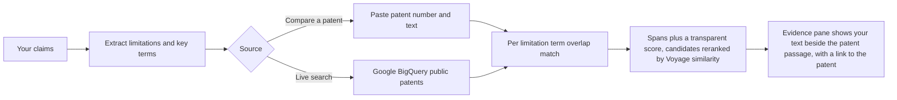
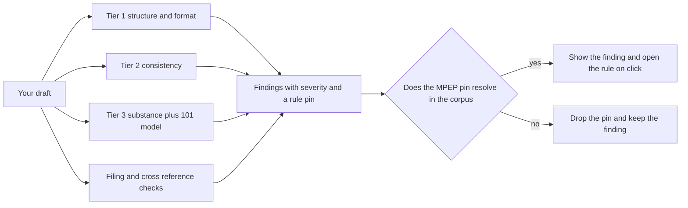
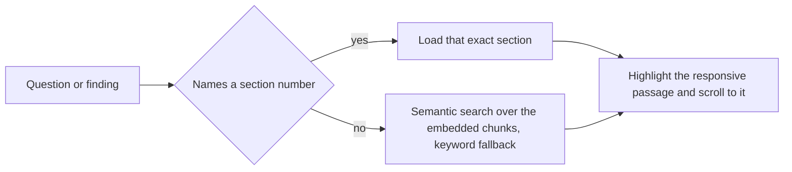
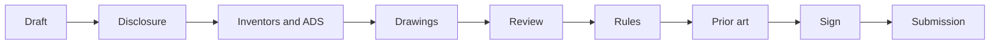

<p align="center"></p>

<p align="center">
  <strong>An active patent review workbench.</strong><br />
  Draft a patent section by section. Pincite flags the rule violations, finds similar public patents,
  and pins every claim it makes to real MPEP text you can open and verify.
</p>

<p align="center">
  
  
  
  
  
  
  
</p>

---

Pincite helps people draft a US patent. It serves both pro se inventors and patent attorneys. It is not legal advice and not a filing service. It checks what you wrote, shows you the governing rule, and produces a filing ready document set that you hand to the USPTO yourself.

---

## A case study, Apple's circular pizza box

To show the whole thing end to end we follow one real, already filed invention through the workflow in the order you would actually use it. It is Apple's molded fiber food container, US 2012/0024859 A1 by Francesco Longoni and Mark E. Doutt, the round vented box Apple designed so a pizza does not go soggy. The draft is kept mid review on purpose so the checks have something to catch. Every bit of text and every figure here is public.

### 1. The dashboard

Every application shows its detected stage, how complete it is, the open issues, and the single next step that matters, with deadline critical steps marked in attention. The sidebar is the spine and the dashboard is one click from anywhere.


### 2. Invention intake

You describe the invention in plain language and Pincite cross references it against your specification and claims. Here it catches a carrying handle that was disclosed but never described, so the draft and the disclosure do not drift apart.


### 3. Inventors and the application data sheet

You name every inventor and say who owns the invention. Apple is the applicant here, a company, so the ownership rules apply. Pincite assembles the ADS data card the USPTO needs and checks it for defects.


### 4. Checking the drawings

Upload a figure and Pincite reads it for drawing defects under 37 CFR 1.84 and 1.83. On Apple's own FIG. 1 it catches reference numerals that appear in the drawing but were never introduced in the specification, circling each one in red and pinning it to the rule. Defects with no single spot, like a missing label or a drawing that is too small, are listed without a circle. The circle positions are an approximate vision estimate, labeled to verify.


### 5. Multiple views

A patent has many views, so you upload as many figures as you need, images or PDFs, tag each with its orientation, and flip between them in one navigator. These 2D drawings are what go in the filing package.

### 6. Error handling in action

Run the checks and the findings come back grouped by area as a scannable list. You triage at a glance instead of reading a wall of text. Two real violations sit at the top, a dependent claim that points at a claim that does not exist and a multiple dependent claim written cumulatively rather than in the alternative.


### 7. Click a finding to see why

Click any finding and you land on the reasoning and the governing rule, side by side with your draft. Here the dependent claim that points at a non existent claim 6 opens MPEP 608.01(n) on dependent claims, scrolled to the relevant passage, with the USPTO source linked.


### 8. Rules that apply now

Alongside the errors, Pincite surfaces the rules that govern this application right now, each one corpus validated and openable in the evidence pane. Conditional rules wait in attention until their trigger is met.


### 9. Stage and what to do now

Pincite reads where the draft sits in the lifecycle, explains why, and says what is missing to advance. Once you declare a status like filed or office action, it tells you the next deadline driven step.


### 10. Finding similar patents

Compare against a patent you paste, or pull candidates from Google BigQuery public patents data. Each result carries a similarity score and decomposes what is similar: the description and claims overlaps are pinned to your own claim element, and you can expand any result to load the actual patent - its title, abstract, and its own drawing - to compare drawing to drawing. The score is a similarity signal, not a novelty or validity verdict.


### 11. Signing the inventor's declaration

The Sign step shows what the declaration says (the five 37 CFR 1.63 statements) and who has to sign it, then hands each inventor the real PTO/AIA/01 declaration as a PDF (attorneys also get the power of attorney).
The inventor signs it by hand and uploads the signed copy, which is the operative signature and is bundled verbatim into the filing package.
Pincite never verifies a signature and never records a click as one.
The filing readiness checks (a missing inventor, address, applicant, or signed declaration) run on the Review step.


### 12. The filing-ready export

The output is a real document set, not a generic PDF. The specification comes out as a 37 CFR 1.77 DOCX with paragraph numbering, and the package adds the ADS data card, the declaration, a transmittal, and a fee summary as a ZIP.


### 13. The audit trail

Every meaningful action is written to an append only audit log you can filter, so there is a complete record of what happened and when.


---

## How it works

The spine of the app is `validateCitations` in [features/mpep/application/validate-citations.ts](features/mpep/application/validate-citations.ts).
Every MPEP number a check or the model produces gets looked up in the ingested corpus before display.
Numbers that resolve are shown and openable.
Numbers that do not resolve get dropped (`resolvePins` nulls the pin and keeps the finding, so the CFR reference still shows).
This is the same reason there is no single novelty score for prior art.
Pincite leads with the spans instead.
How the code is organized to keep that discipline is in [Architecture](#architecture) below.

Similar patents


```mermaid
flowchart LR
  A[Your claims] --> B[Extract limitations and key terms]
  B --> C{Source}
  C -->|Compare a patent| D[Paste patent number and text]
  C -->|Live search| E[Google BigQuery public patents]
  D --> F[Per limitation term overlap match]
  E --> F
  F --> G[Spans plus a transparent score, candidates reranked by Voyage similarity]
  G --> H[Evidence pane shows your text beside the patent passage, with a link to the patent]
```

Error checking


```mermaid
flowchart LR
  A[Your draft] --> B[Tier 1 structure and format]
  A --> C[Tier 2 consistency]
  A --> D[Tier 3 substance plus 101 model]
  A --> E[Filing and cross reference checks]
  B --> F[Findings with severity and a rule pin]
  C --> F
  D --> F
  E --> F
  F --> G{Does the MPEP pin resolve in the corpus}
  G -->|yes| H[Show the finding and open the rule on click]
  G -->|no| I[Drop the pin and keep the finding]
```

MPEP locate


```mermaid
flowchart LR
  A[Question or finding] --> B{Names a section number}
  B -->|yes| C[Load that exact section]
  B -->|no| D[Semantic search over the embedded chunks, keyword fallback]
  C --> E[Highlight the responsive passage and scroll to it]
  D --> E
```

The whole filing flow lives on a left step rail. Each step turns green when it is complete.


```mermaid
flowchart LR
  D[Draft] --> I[Disclosure] --> N[Inventors and ADS] --> W[Drawings]
  W --> R[Review] --> U[Rules] --> P[Prior art] --> S[Sign] --> X[Submission]
```

The export is a real document set rather than a generic PDF. The specification comes out as a 37 CFR 1.77 DOCX with `[0001]` paragraph numbering and claims and abstract on their own pages, which also avoids the USPTO non DOCX surcharge. The package adds an ADS data card for the Patent Center web form, the inventor declaration, a transmittal, and a fee summary, bundled as a ZIP.

---

## What else is in the box

<table>
  <tr>
    <td width="33%" valign="top">
      <h4>Two roles</h4>
      <p>Pro se inventors sign their own oath. Attorneys get a portfolio across clients and the power of attorney path.</p>
    </td>
    <td width="33%" valign="top">
      <h4>Lifecycle actions</h4>
      <p>What to do now by status, from an office action reply to the issue fee to maintenance fees, each pinned to its rule.</p>
    </td>
    <td width="33%" valign="top">
      <h4>Signed declaration</h4>
      <p>The inventor declaration is recorded and checked for defects, like a name that does not match the application data sheet.</p>
    </td>
  </tr>
  <tr>
    <td width="33%" valign="top">
      <h4>USPTO export</h4>
      <p>A 37 CFR 1.77 specification DOCX plus an ADS data card, a declaration, a transmittal, and a fee summary in one ZIP.</p>
    </td>
    <td width="33%" valign="top">
      <h4>Versioning and audit</h4>
      <p>Every save is an append only snapshot and every meaningful action is written to an audit log.</p>
    </td>
    <td width="33%" valign="top">
      <h4>Confidentiality and cost</h4>
      <p>US region storage with row level security per user, per user rate limits and budget caps on every paid call, and synthetic text only until xAI zero data retention is on (Voyage already opted out).</p>
    </td>
  </tr>
</table>

---

## Tech stack

| Layer | Tools |
| --- | --- |
| Framework | Next.js 15 App Router with React Server Components, Server Actions, and Route Handlers |
| Language | TypeScript 5 |
| UI | React 19, Tailwind CSS v4, shadcn/ui on Radix primitives, lucide-react icons, Turbopack in dev |
| Design system | A three signal color system where red is a violation, yellow is attention, and green is a pass, each with a shape and a label for accessibility |
| Database | Supabase Postgres with pgvector for embeddings and a tsvector full text index for MPEP search |
| Data access | PostgREST through `@supabase/supabase-js` with cookie based SSR sessions through `@supabase/ssr` |
| Migrations | Raw SQL applied with node-postgres (`pg`) via `scripts/db-apply.mjs` |
| Security | Row level security on every table, per user rate limits and account wide budget caps on paid calls, append only versioning, and an audit log |
| Auth | Supabase Auth with email and password plus Google OAuth, and a development only login used by the tests |
| Storage | A private US region Supabase Storage bucket for drawings, written through an ownership checked service role client |
| Generation model | xAI Grok `grok-4.3` for the §101 walkthrough |
| Embeddings | Voyage `voyage-law-2`, a legal tuned 1024 dimension model, over the MPEP corpus |
| Prior art | Google BigQuery `patents-public-data` through a service account, with PatentsView as a key free fallback |
| Export | `docx` for the specification and `jszip` for the filing package |
| Testing | Vitest unit and application tests that need no credentials, a Playwright end to end gate, and `@axe-core/playwright` for accessibility |
| Tooling | pnpm, ESLint with architectural boundary rules, GitHub Actions CI (lint, typecheck, unit tests, build) |

---

## Data model

```
projects             id, user_id, name, patent_type, declared_status, applicant fields, entity_status, client_name, matter_no
project_sections     project_id, section_key, content, word_count        (history in project_versions, append only)
project_disclosure   project_id, problem_solved, how_it_works, components, advantages, alternatives, known_prior_art
project_inventors    project_id, legal_name, residence, mailing_address, citizenship
project_declarations project_id, inventor_id, legal_name, statements, signed_at        (append only)
project_attachments  project_id, kind, storage_path, filename, mime       (bytes live in the private Storage bucket)
findings             project_id, section_key, span_start, span_end, severity, kind, mpep_section, cfr_ref
mpep_sections        the ingested MPEP, with a tsvector full text index
mpep_chunks          chunked MPEP text embedded into a pgvector column
prior_art_matches    scored candidate patents, with the pinpoint overlaps in match_spans
audit_log            append only record of every meaningful action
```

Row level security scopes every table to its owner. Saves never overwrite history.

---

## Running it locally

```bash
pnpm install

# Create .env.local (never committed). It needs at least these names.
#   NEXT_PUBLIC_SUPABASE_URL
#   NEXT_PUBLIC_SUPABASE_ANON_KEY
#   SUPABASE_SERVICE_ROLE_KEY
#   SUPABASE_DB_URL                  direct Postgres URL for migrations
#   XAI_API_KEY                      Grok generation
#   GEMINI_API_KEY                   fallback generation
#   VOYAGE_API_KEY                   MPEP embeddings
#   GOOGLE_APPLICATION_CREDENTIALS   local path to a BigQuery service account JSON (outside the repo)
#   GOOGLE_APPLICATION_CREDENTIALS_JSON  or the full service account JSON inline (production / Vercel)
#   DEV_LOGIN_SECRET                 development only test login

# Apply the schema, then reload the PostgREST cache.
node --env-file=.env.local scripts/db-apply.mjs supabase/migrations/0001_phase0_init.sql
#   repeat through the latest migration, then run  notify pgrst, 'reload schema'

# Set up the private Storage bucket for drawings.
node --env-file=.env.local scripts/setup-storage.mjs

# Ingest the MPEP text, then embed it (the embed pass is resumable).
node --env-file=.env.local scripts/ingest-mpep.mjs
node --env-file=.env.local scripts/embed-mpep.mjs

pnpm dev    # http://localhost:3100
```

Other commands are `pnpm test` (unit and application tests, no credentials needed), `pnpm typecheck`, `pnpm lint` (includes the architecture boundary rules), `pnpm build`, `pnpm exec playwright test` for the full end to end gate, and `pnpm exec playwright test e2e/<feature>.spec.ts` for one.
Port 3100 is intentional because 3000 is reserved for another local app.

---

## Architecture

Pincite is a feature oriented modular monolith on the Next.js App Router.
`app/` is a thin routing layer, every product capability lives in one folder under `features/`, and the framework free plumbing lives in `shared/`.

```
app/
  (public)/            /, /home, /login, /privacy, /terms
  (protected)/         layout enforces auth + consent; dashboard, settings, ask, projects/[id]/*
  consent/  role/      signed in but not yet consented or role picked
  auth/  api/          OAuth callback, sign out, dev login, attachments, declaration, export, audit CSV
features/
  <feature>/
    domain/            pure TypeScript: no Next, React, Supabase, network, clock, or auth
    application/       one file per use case; composes domain with infrastructure, marked server-only
    infrastructure/    Supabase, Storage, BigQuery, LLM adapters, marked server-only
    actions.ts         "use server" entry points, each under ~40 lines
    ui/                React components for this feature
shared/
  auth/                requireViewer, getViewer, the pure access rule, role types, the admin allowlist
  db/                  typed server, browser, admin, and middleware clients plus database.types.ts
  audit/  rate-limit/  llm/  text/  format.ts  utils.ts
components/            app shell (sidebar, step rail, command palette), marketing site, shadcn primitives
src/visual/            animation agnostic visuals shared by the site and the Remotion demo
```

### Dependency direction

```
app/ and ui/  ->  application/  ->  domain/
                               ->  infrastructure/
```

Domain never imports up.
A feature may import another feature's `domain`, `application`, `actions`, or `ui`, but never its `infrastructure`.
Routes, UI, and components never touch infrastructure, the server or admin database clients, providers, or the rate limiter.
These rules are enforced by `no-restricted-imports` groups in [eslint.config.mjs](eslint.config.mjs), so a violation fails `pnpm lint` instead of waiting for review.
Every application and infrastructure module starts with `import "server-only"`, so the bundler refuses to ship a server SDK or a document generator to the browser.

### Features

| Feature | Owns |
| --- | --- |
| `projects` | matters, sections, append only versions, stage detection, lifecycle actions, readiness, the dashboard summary, and the request scoped `ProjectSnapshot` |
| `review` | the claim parser, tier 1 to 3 validators, cross reference and filing checks, citation partitioning, guided auto fix, the §101 walkthrough, and the review screen (the reference slice) |
| `mpep` | the corpus: load, locate, keyword and semantic search, Ask, citation validation and `resolvePins` |
| `prior-art` | limitation extraction, BigQuery and keyless search, Voyage ranking, pinpoint matching, results |
| `rules` | applies now and conditional rule surfacing |
| `filing` | inventors, applicant, the ADS card, the declaration statements, the sign page |
| `drawings` | uploads, upload policy, signed URL and raw streaming, vision review assembly, orientation, delete |
| `disclosure` | the plain language intake and its consistency check against the draft |
| `exports` | the export context, every format builder, the filing package, and the export log |
| `audit` | the per matter audit viewer and the CSV export |
| `account` | login, consent, role selection, settings |

### Authentication and authorization

`shared/auth/require-viewer.ts` wraps one request cached lookup (`React.cache`) of the Supabase user and profile.
`getViewer()` never redirects and returns `null` when signed out, so route handlers can answer 401.
`requireViewer()` redirects to `/login` or `/consent`, and `requireUser()` checks the session only, for the consent and role screens.
The `(protected)` layout calls `requireViewer()`, and every protected page calls it once more, because Next layouts do not re-render on soft navigation; the second call is served from the request cache.
Server actions authenticate themselves with `requireViewer()` before doing anything.
Row level security on every user table is defense in depth, not the only gate: application code checks ownership through the user scoped client before any service role or Storage work, and the service role client is used only for Storage and for the two attachment columns that have no user update policy.

### The project snapshot

`getProjectSnapshot(projectId)` in `features/projects/application` is the one canonical loader for a matter: project, every section (missing rows default to `""`), inventors, attachments, disclosure, and export records, started together with `Promise.all` and deduplicated per request with `React.cache`.
It returns `null` when the project is not visible to the viewer.
Nothing user scoped is ever placed in a persistent Next cache.
Loaders that run after a write in the same request read fresh through their own repository instead of the snapshot, so a recompute never sees stale text.
The dashboard does not go through the snapshot: it loads every matter's rows in one batched query per table and derives stage, completeness, open issues, and next step with a pure `summarizeDashboardProject`.

### One read flow: opening Review

1. `app/(protected)/projects/[id]/review/page.tsx` awaits `params`, calls `requireViewer()`, then `getReviewPage(id)`, and renders `ReviewScreen` or `notFound()`.
2. `features/review/application/get-review-page.ts` loads the snapshot and the stored findings in parallel, runs the pure `runFilingChecks` and `runCrossRefChecks`, and drops unresolved MPEP pins with `resolvePins`.
3. `features/review/ui/review-screen.tsx` renders the banners and the client, which is split into toolbar, finding groups, finding item, fix proposal, and eligibility panel.

### One write flow: accepting a proposed fix

1. `FixProposal` calls the `applyFix` server action in `features/review/actions.ts`.
2. The action calls `requireViewer()`, hands the input to `applyFix` in `features/review/application/apply-fix.ts`, and revalidates the review and draft paths.
3. The use case reads the section fresh, uses the pure `applyReplacement` from `domain/fix.ts` to replace the occurrence nearest the flagged span, writes through `infrastructure/section-writer.ts`, logs `section_edited` to the audit trail, then reruns `runDeterministicValidators`, validates every MPEP pin against the corpus, and replaces the stored findings.

### Testing layers

- Unit tests (`pnpm test`, Vitest, colocated `*.test.ts`) cover the pure domain: validators, claim parsing, citation partitioning, stage detection, readiness, completeness, dashboard summaries, drawing review assembly, upload policy, and every export serializer, all without credentials.
- Application tests use small in memory fakes for repositories and providers to check orchestration: rate limits short circuit before any paid call, audit rows carry the right detail, findings are persisted with unresolved pins nulled, exports are recorded once per download and never for a preview.
- Playwright (`pnpm exec playwright test`) keeps the end to end journeys: login and consent, matters and saves, review and auto fix, prior art, uploads and drawings, filing and exports, account isolation, and accessibility.
- CI runs lint, typecheck, unit tests, and the production build on every push.

### Data types

`shared/db/database.types.ts` is the `Database` type every client is parameterized with.
It is derived from `supabase/migrations/*.sql` and should be regenerated with `supabase gen types typescript` whenever the schema changes; a mismatch there is a bug in that file.
Rows are mapped into domain objects explicitly where the shapes differ (jsonb columns such as a drawing's persisted analysis or a version snapshot).

---

## Disclaimer

Pincite is not legal advice and not a filing service. A human stays in the loop. A similarity hit is a candidate to verify, not a conclusion about validity or patentability. Use synthetic or non confidential text for now, because real unfiled invention text should only go to zero data retention vendors. Voyage retention is opted out, and xAI zero data retention is the last piece to enable, so it stays the blocker until then. The unit layer is 617 credential free tests, and the Playwright gate is 32 specs with the accessibility scan on every screen. Semantic MPEP locate and Voyage semantic candidate ranking for prior art are now wired. Drawings get a vision check too. A model reads a figure and Pincite flags drawing issues under 37 CFR 1.84 and 1.83, a reference numeral on the drawing that is not in the specification, a missing figure label, and a disclosed component that is not shown, marking each located issue with a numbered red circle on the figure pinned to the rule, restricted to public or synthetic figures until vendor zero data retention is on.
