<p align="center">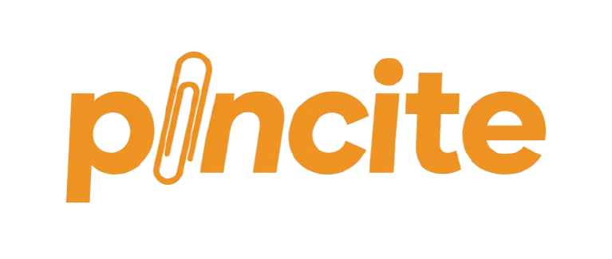</p>

<p align="center">
  <strong>An active patent review workbench.</strong><br />
  Draft a patent section by section. Pincite flags the rule violations, finds similar public patents,
  and pins every claim it makes to real MPEP text you can open and verify.
</p>

<p align="center">
  
  
  
  
  
  
</p>

---

## For Full Stack at Brown reviewers

### Overview

Pincite is a web app for drafting a US patent application. You write each section, run the checks, and every issue it raises opens the exact passage of the USPTO's Manual of Patent Examining Procedure (MPEP) that governs it, beside your draft. It also compares your claims against public patents and exports a filing ready document set. It is not legal advice and not a filing service.

### How to run it

```bash
corepack enable   # gets you pnpm if you only have npm
pnpm install
pnpm dev          # http://localhost:3100
```

With no `.env.local` present the app starts in demo mode. There is no login, the Apple case study below is preloaded, and the features that call paid APIs (the §101 walkthrough, the drawing vision check, live prior art search) show precomputed results. To run against your own database and model keys, see [Full setup with your own keys](#full-setup-with-your-own-keys).

### Your contribution

Solo project. I built all of it, using Claude Code and Codex for implementation with the conventions in `CLAUDE.md`.

The interaction to try is on the Review step. Click a finding and its MPEP rule opens beside the list.

- `features/review/ui/review-client.tsx` owns the state. `selectedId` is the open finding and `rule` is the loaded MPEP section. `selectFinding` toggles `selectedId` and calls the `getRuleSection` server action to fetch the section text.
- `FindingGroups` receives `findings`, `selectedId`, and `onSelect` as props. `EvidencePane` receives `section` and `span`.
- `features/mpep/ui/evidence-pane.tsx` renders the section. When a caller passes a span, as the Ask screen does, it wraps that passage in a highlight and scrolls it into view in a `useEffect`. The Review step passes no span, so the rule opens from the top.
- When the checks run, `features/review/application/run-review.ts` validates every MPEP pin with `validateCitations` before the findings are stored. Before the page renders, `features/review/application/get-review-page.ts` runs the filing readiness checks through `resolvePins` the same way, so a finding only shows an MPEP pin that exists in the corpus.

### What you learned

The model kept citing MPEP sections that do not exist. A patent tool that invents rule numbers is worse than no tool, so I ingested the full MPEP into Postgres and made citation validation a hard gate. `validateCitations` in `features/mpep/application/validate-citations.ts` looks up every section number before it reaches the screen. `resolvePins` nulls the pin and keeps the finding, so the user still sees the problem and the CFR reference, just without a citation that cannot be opened. The same reasoning is why prior art results lead with matched spans instead of a single novelty score.

### References

Next.js, React, Supabase, and Playwright docs. shadcn/ui for the component primitives. The USPTO's MPEP as the corpus and Apple's public application US 2012/0024859 A1 for the case study. Claude Code and Codex for implementation.

---

## A case study, Apple's circular pizza box

One real, already filed invention followed through the workflow in order. It is Apple's molded fiber food container, US 2012/0024859 A1, the round vented box designed so a pizza does not go soggy. The draft is kept mid review on purpose so the checks have something to catch. Every bit of text and every figure is public.

### 1. The dashboard

Each application shows its stage, how complete it is, the open issues, and the one next step, with deadline driven steps marked in attention.

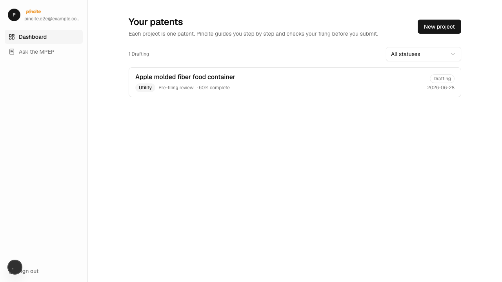

### 2. Invention intake

Describe the invention in plain language and Pincite cross references it against the specification and claims. Here it catches a carrying handle that was disclosed but never described.

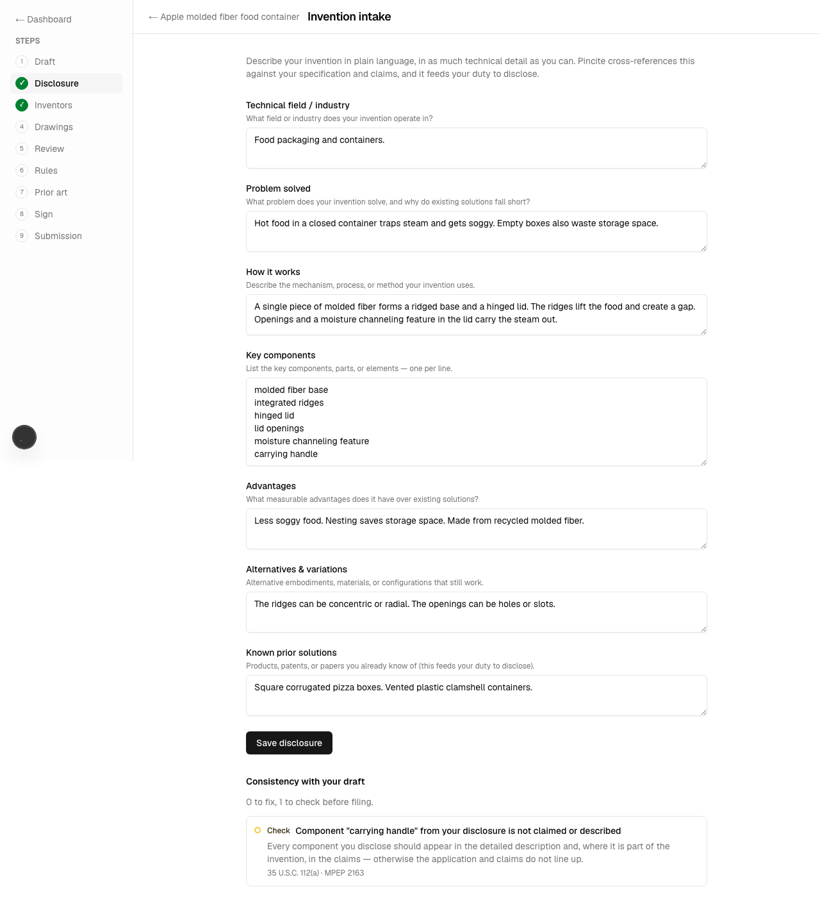

### 3. Inventors and the application data sheet

Name every inventor and the applicant. Pincite assembles the application data sheet the USPTO needs and checks it for defects.

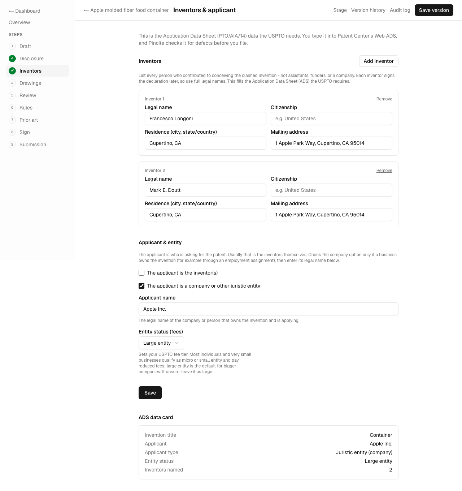

### 4. Checking the drawings

Upload as many figures as you need, images or PDFs, and Pincite checks each under 37 CFR 1.84 and 1.83. On Apple's FIG. 1 it circles reference numerals that appear in the drawing but never in the specification, each pinned to the rule. Circle positions are a vision estimate and are labeled to verify.

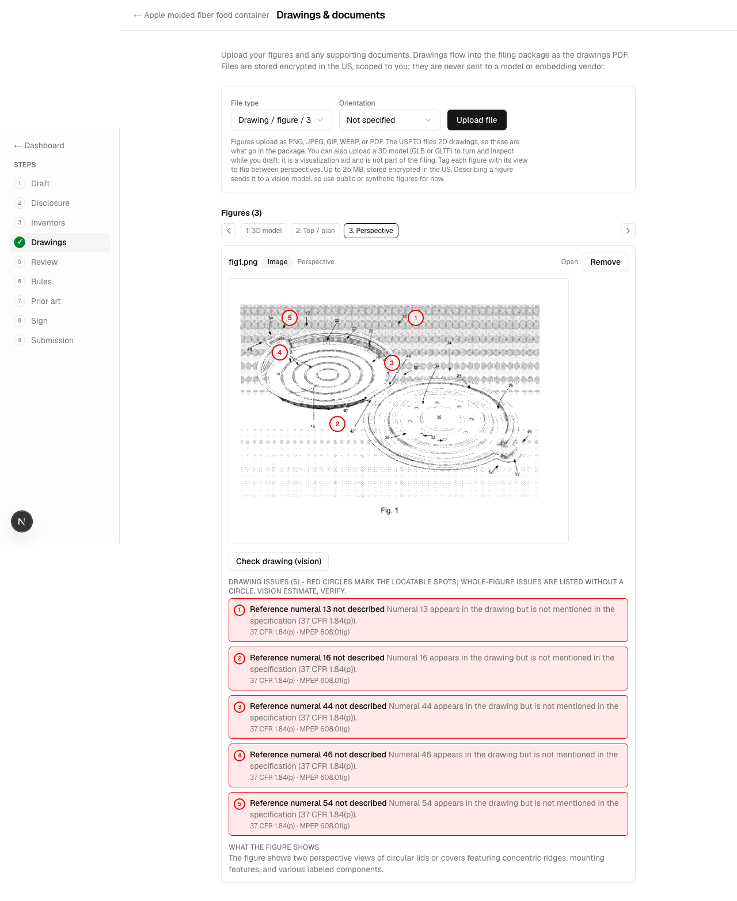

### 5. Review

Run the checks and the findings come back grouped by area. Two real violations sit at the top, a dependent claim that points at a claim that does not exist and a multiple dependent claim written cumulatively instead of in the alternative.

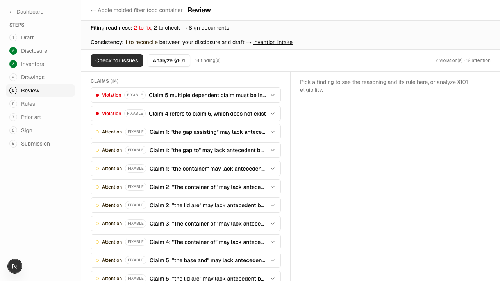

### 6. Click a finding to see why

The governing rule opens beside your draft. Here the bad dependent claim opens MPEP 608.01(n), with the USPTO source linked.

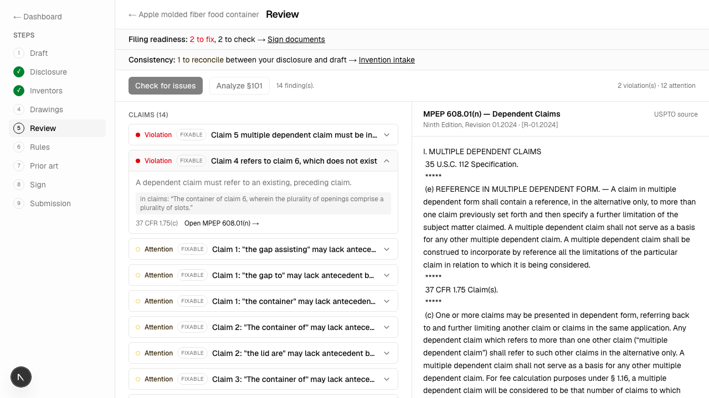

### 7. Rules that apply now

Pincite also lists the rules that govern this application right now, each corpus validated. Conditional rules wait in attention until their trigger is met.

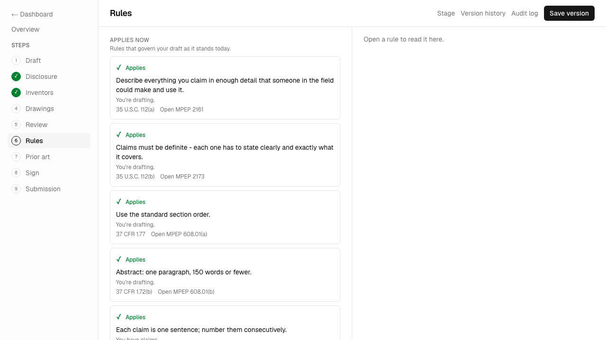

### 8. Stage and what to do now

Pincite reads where the draft sits in the lifecycle and what is missing to advance. Once you declare a status like filed, it gives the next deadline driven step.

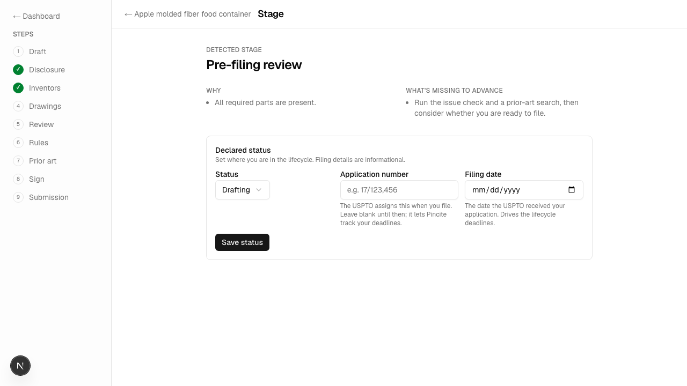

### 9. Finding similar patents

Compare against a patent you paste or pull candidates from Google BigQuery public patents data. Each result carries a similarity score and pins the description and claims overlaps to your own claim elements. Expand a result to load the patent and its drawing. The score is a similarity signal and says nothing about novelty or validity.

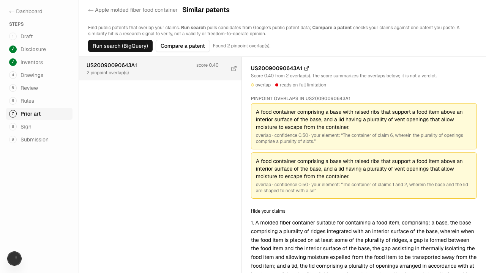

### 10. Signing the inventor's declaration

The Sign step shows the five 37 CFR 1.63 statements and hands each inventor the real PTO/AIA/01 declaration as a PDF. The inventor signs by hand and uploads the signed copy, which goes into the filing package verbatim. Pincite never records a click as a signature.

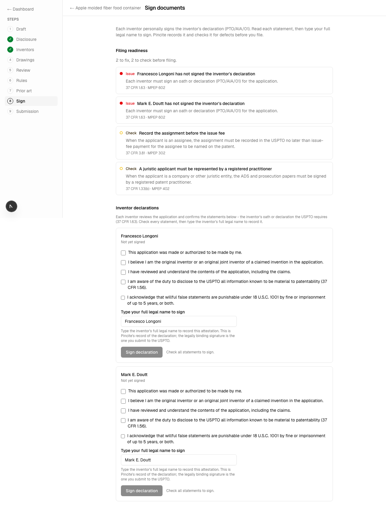

### 11. The filing ready export

The specification comes out as a 37 CFR 1.77 DOCX with paragraph numbering, which also avoids the USPTO non DOCX surcharge. The package adds the ADS data card, the declaration, a transmittal, and a fee summary in one ZIP.

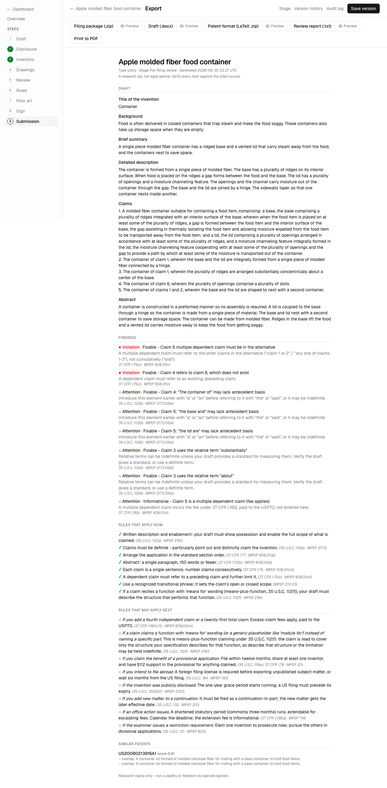

### 12. The audit trail

Every meaningful action goes to an append only audit log you can filter.

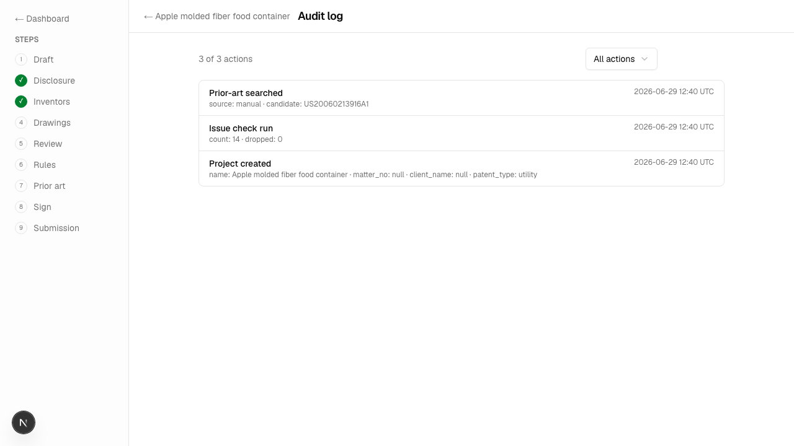

---

## How it works

Every MPEP number a check or the model produces is looked up in the ingested corpus before display. See `validateCitations` in [features/mpep/application/validate-citations.ts](features/mpep/application/validate-citations.ts).

Error checking

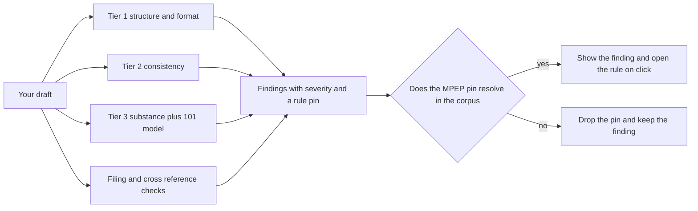
```mermaid
flowchart LR
  A[Your draft] --> B[Tier 1 structure and format]
  A --> C[Tier 2 consistency]
  A --> D[Tier 3 substance plus 101 model]
  A --> E[Filing and cross reference checks]
  B --> F[Findings with severity and a rule pin]
  C --> F
  D --> F
  E --> F
  F --> G{Does the MPEP pin resolve in the corpus}
  G -->|yes| H[Show the finding and open the rule on click]
  G -->|no| I[Drop the pin and keep the finding]
```

Similar patents

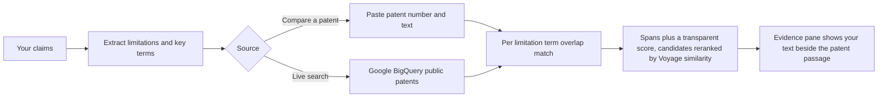
```mermaid
flowchart LR
  A[Your claims] --> B[Extract limitations and key terms]
  B --> C{Source}
  C -->|Compare a patent| D[Paste patent number and text]
  C -->|Live search| E[Google BigQuery public patents]
  D --> F[Per limitation term overlap match]
  E --> F
  F --> G[Spans plus a transparent score, candidates reranked by Voyage similarity]
  G --> H[Evidence pane shows your text beside the patent passage]
```

---

## Tech stack

| Layer | Tools |
| --- | --- |
| Framework | Next.js 15 App Router with React Server Components, Server Actions, and Route Handlers |
| Language | TypeScript 5 |
| UI | React 19, Tailwind CSS v4, shadcn/ui on Radix primitives, lucide-react icons |
| Design system | Red is a violation, yellow is attention, green is a pass, each with a shape and a label so color is never the only signal |
| Database | Supabase Postgres with pgvector for embeddings and a tsvector index for MPEP search. Raw SQL migrations applied with `pg` via `scripts/db-apply.mjs` |
| Data access | `@supabase/supabase-js` with cookie based SSR sessions through `@supabase/ssr` |
| Security | Row level security on every table, per user rate limits and budget caps on paid calls, append only versioning, and an audit log |
| Auth | Supabase Auth with email and password plus Google OAuth, and a development only login used by the tests |
| Storage | A private US region Supabase Storage bucket for drawings |
| Generation model | xAI Grok `grok-4.3` for the §101 walkthrough |
| Embeddings | Voyage `voyage-law-2` over the MPEP corpus |
| Prior art | Google BigQuery `patents-public-data`, with PatentsView as a key free fallback |
| Export | `docx` for the specification and `jszip` for the filing package |
| Testing | Vitest unit and application tests that need no credentials, a Playwright end to end gate, and `@axe-core/playwright` for accessibility |
| Tooling | pnpm, ESLint with architectural boundary rules, GitHub Actions CI |

---

## Data model

```
projects             id, user_id, name, patent_type, declared_status, applicant fields, entity_status, client_name, matter_no
project_sections     project_id, section_key, content, word_count        (history in project_versions, append only)
project_disclosure   project_id, problem_solved, how_it_works, components, advantages, alternatives, known_prior_art
project_inventors    project_id, legal_name, residence, mailing_address, citizenship
project_declarations project_id, inventor_id, legal_name, statements, signed_at        (append only)
project_attachments  project_id, kind, storage_path, filename, mime       (bytes live in the private Storage bucket)
findings             project_id, section_key, span_start, span_end, severity, kind, mpep_section, cfr_ref
mpep_sections        the ingested MPEP, with a tsvector full text index
mpep_chunks          chunked MPEP text embedded into a pgvector column
prior_art_matches    scored candidate patents, with the pinpoint overlaps in match_spans
audit_log            append only record of every meaningful action
```

Row level security scopes every table to its owner. Saves never overwrite history.

---

## Full setup with your own keys

```bash
pnpm install

# Create .env.local (never committed) with these names.
#   NEXT_PUBLIC_SUPABASE_URL
#   NEXT_PUBLIC_SUPABASE_ANON_KEY
#   SUPABASE_SERVICE_ROLE_KEY
#   SUPABASE_DB_URL                        direct Postgres URL for migrations
#   XAI_API_KEY                            Grok generation
#   GEMINI_API_KEY                         fallback generation
#   VOYAGE_API_KEY                         MPEP embeddings
#   GOOGLE_APPLICATION_CREDENTIALS         path to a BigQuery service account JSON, outside the repo
#   GOOGLE_APPLICATION_CREDENTIALS_JSON    or the JSON inline, for Vercel
#   DEV_LOGIN_SECRET                       development only test login

# Apply each migration in order, then run  notify pgrst, 'reload schema'
node --env-file=.env.local scripts/db-apply.mjs supabase/migrations/0001_phase0_init.sql

# Storage bucket for drawings
node --env-file=.env.local scripts/setup-storage.mjs

# Ingest the MPEP, then embed it (resumable)
node --env-file=.env.local scripts/ingest-mpep.mjs
node --env-file=.env.local scripts/embed-mpep.mjs

pnpm dev    # http://localhost:3100
```

Other commands are `pnpm test`, `pnpm typecheck`, `pnpm lint`, `pnpm build`, and `pnpm exec playwright test` for the end to end gate. Port 3100 is intentional because 3000 is reserved for another local app.

---

## Architecture

A feature oriented modular monolith on the Next.js App Router. `app/` is a thin routing layer, every product capability lives in one folder under `features/`, and framework free plumbing lives in `shared/`.

```
app/
  (public)/            /, /home, /login, /privacy, /terms
  (protected)/         layout enforces auth + consent; dashboard, settings, ask, projects/[id]/*
  consent/  role/      signed in but not yet consented or role picked
  auth/  api/          OAuth callback, sign out, dev login, attachments, declaration, export, audit CSV
features/
  <feature>/
    domain/            pure TypeScript, no Next, React, Supabase, network, clock, or auth
    application/       one file per use case, composes domain with infrastructure, server-only
    infrastructure/    Supabase, Storage, BigQuery, LLM adapters, server-only
    actions.ts         "use server" entry points, each under ~40 lines
    ui/                React components for this feature
shared/
  auth/                requireViewer, getViewer, role types, the admin allowlist
  db/                  typed server, browser, admin, and middleware clients plus database.types.ts
  audit/  rate-limit/  llm/  text/  format.ts  utils.ts
components/            app shell (sidebar, step rail, command palette), marketing site, shadcn primitives
```

Dependency direction is `app/` and `ui/` to `application/` to `domain/` or `infrastructure/`. Domain never imports up, and no route or component touches infrastructure or the server database clients. These rules are `no-restricted-imports` groups in [eslint.config.mjs](eslint.config.mjs), so a violation fails `pnpm lint`. Every application and infrastructure module starts with `import "server-only"`.

| Feature | Owns |
| --- | --- |
| `projects` | matters, sections, append only versions, stage detection, lifecycle actions, readiness, the dashboard summary |
| `review` | the claim parser, tier 1 to 3 validators, cross reference and filing checks, guided auto fix, the §101 walkthrough, and the review screen |
| `mpep` | the corpus: load, locate, keyword and semantic search, Ask, citation validation and `resolvePins` |
| `prior-art` | limitation extraction, BigQuery and keyless search, Voyage ranking, pinpoint matching |
| `rules` | applies now and conditional rule surfacing |
| `filing` | inventors, applicant, the ADS card, the declaration statements, the sign page |
| `drawings` | uploads, upload policy, signed URL streaming, vision review, orientation, delete |
| `disclosure` | the plain language intake and its consistency check against the draft |
| `exports` | every format builder, the filing package, and the export log |
| `audit` | the per matter audit viewer and the CSV export |
| `account` | login, consent, role selection, settings |

Every protected page and server action calls `requireViewer()` before doing anything. Row level security is defense in depth. Application code checks ownership through the user scoped client before any service role or Storage work.

Testing runs in three layers. Vitest covers the pure domain with no credentials (668 tests). Application tests use in memory fakes to check orchestration, for example that rate limits short circuit before any paid call. Playwright covers the end to end journeys (33 specs) with an accessibility scan on every screen. CI runs lint, typecheck, unit tests, and the production build on every push.

---

## Disclaimer

Pincite is not legal advice and not a filing service. A human stays in the loop. A similarity hit is a candidate to verify. Use synthetic or non confidential text for now. Voyage retention is opted out, and xAI zero data retention is not yet enabled, so real unfiled invention text should not go through it until it is.
